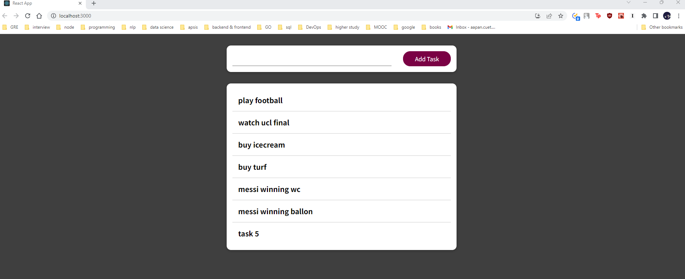

# TO DO app

## Overview

This Todo app project consists of a client-server application where the client is developed using React and the server is built with Node.js. The server utilizes Redis for caching and MySQL for data storage.

## Client

The client-side application is developed using React. It provides a user interface for interacting with the server's APIs.

To run client application, follow these steps:

## Prerequisites

Make sure you have the following installed on your machine:

- Node.js: The Node.js runtime environment is required to run the React application. You can download it from the official Node.js website (https://nodejs.org) and follow the installation instructions for your operating system.

## Setup

1. Clone the repository or navigate to the project directory in your terminal.

   ```bash
   git clone <repository-url>
   cd client
   npm install
   npm start
   ```

   This will open `localhost:3000` with an interface like below:

   

## Server

The server-side application is built with Node.js. It provides APIs to handle client requests and interacts with Redis and MySQL for caching and data storage, respectively. Some notable aspects of the server include:

- Express.js framework for handling HTTP requests and routing.
- Integration with Redis for caching frequently accessed data and improving performance.
- Integration with MySQL database for storing and retrieving data.

To run a server side application, follow these steps:

1. Navigate to the server application using the `cd` command.

   ```bash
   cd server
   npm install
   npm start
   ```

   it will open run the server on the `port:8000`. Make sure to keep it available.

##Api Endpoints

### Get todo list

- **URL**: `/data`
- **Method**: `GET`
- **Description**: fetches all existing tasks from database
- **Response**:
  - ```json
    [
      {
        "id": 1,
        "todos": "play football"
      },
      {
        "id": 2,
        "todos": "watch ucl final"
      },
      {
        "id": 3,
        "todos": "buy icecream"
      },
      {
        "id": 4,
        "todos": "buy turf"
      },
      {
        "id": 5,
        "todos": "messi winning wc"
      },
      {
        "id": 6,
        "todos": "messi winning ballon"
      }
    ]
    ```

### Create task

- **URL**: `/data`
- **Method**: `POST`
- **Description**: creates a task
- **Request Body**:

  - ```json
    {
      "todos": "messi winning ballon"
    }
    ```

- **Response**:

  - ```json
    {
      "id": 6,
      "todos": "messi winning ballon"
    }
    ```

## Redis

Redis is used in the server-side application as a caching mechanism. It helps improve the application's performance by storing frequently accessed data in memory. Key points about Redis usage include:

- Utilizing Redis as an in-memory data store for caching frequently accessed data.
- Employing Redis commands and data structures to efficiently store and retrieve cached data.
- Setting appropriate expiration policies for cached data to ensure freshness.

## MySQL

MySQL is used as the database management system for the server-side application. It is responsible for persistently storing and retrieving data. Key aspects of MySQL usage include:

To generate the tables enter the following command:

```bash
prisma migrate dev
```

## Conclusion

This documentation provides an overview of the project structure and components. It covers the client built with React, the server built with Node.js, and the usage of Redis for caching and MySQL for data storage. Refer to specific sections or modules for more detailed information on each component.
